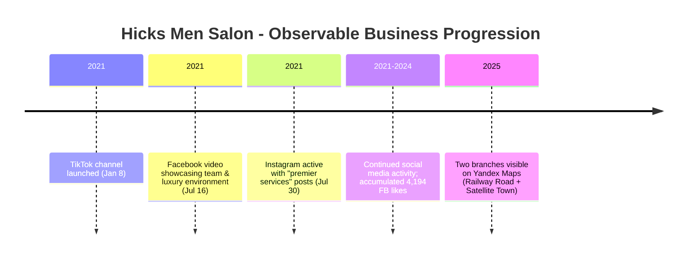

# 🔬 Research Report: Hicks Men Salon — Bahawalpur, Pakistan

---

## 1. Executive Summary

Hicks Men Salon is a **men's grooming and beauty establishment** operating in **Bahawalpur, Punjab, Pakistan**. Based on available evidence, the salon positions itself as a **premium/luxury men's salon** offering hair, beard, facial, and spa services. The business maintains an active presence across multiple social platforms (Facebook, Instagram, TikTok, YouTube) and appears to have at least **two operational branches** within Bahawalpur. The salon has been active on social media since at least **early-to-mid 2021**, indicating an operational history of approximately **4+ years** as of this research date.

---

## 2. Branches & Locations

### Branch 1 — Railway Road (Main Branch)

| Attribute | Detail |
|---|---|
| **Name (as listed)** | Hicks Men Salon Branch 2 (per Yandex Maps title) — however, listed as main branch in FB description |
| **Address** | Fandi Center, near Raja Pump Chowk, Railway Road, Bahawalpur, Punjab, Pakistan |
| **District** | Bahawalpur District |
| **Province** | Punjab |
| **Landmark** | Opposite Noor Marriage Club, near Raja Pump Chowk |
| **Source** | Yandex Maps listing |
| **Authenticity** | ⭐⭐⭐⭐ (Listed on a mapping platform with photos and contact) |

### Branch 2 — Satellite Town Branch

| Attribute | Detail |
|---|---|
| **Name** | Hicks Men Salon Branch 2 |
| **Address** | Satellite Town, Bahawalpur District, Bahawalpur, Punjab, Pakistan |
| **Source** | Yandex Maps listing (separate page titled "Hicks Men Salon Branch 2") |
| **Authenticity** | ⭐⭐⭐ (Separate Yandex Maps listing exists; exact street address not fully specified) |

> **Note on Branch Identification:**  
> The Yandex Maps listings present some ambiguity — the "Branch 2" label appears on the Railway Road listing, while a separate listing titled "Hicks Men Salon Branch 2" references Satellite Town. This suggests **two distinct branches** exist, but the exact numbering/labeling between them is inconsistent across sources. Both listings share the same phone number (+92 346 8541177), supporting the conclusion that both belong to the same business entity.

---

## 3. Contact Information

| Source | Phone Number | Authenticity |
|---|---|---|
| **Yandex Maps (both branches)** | +92 346 8541177 | ⭐⭐⭐⭐ (Listed on mapping platform) |
| **Facebook Page snippet** | +92 325 8079200 (seen in "Contact us +923258079200") | ⭐⭐⭐ (Visible in FB page content) |

> **Discrepancy Note:**  
> Two different phone numbers appear across sources. This could indicate: (a) two different branch contact lines, (b) a change in contact number over time, or (c) one being a personal/whatsapp line of the owner. Without direct confirmation from the business, both are listed but neither can be definitively ranked above the other.

### Social Media Handles

| Platform | Handle / URL | Followers / Engagement | Authenticity |
|---|---|---|---|
| **Facebook** | facebook.com/hicksmens | 4,194 likes; 4,174 followers; 5.0 rating | ⭐⭐⭐⭐⭐ (Verified page, active since visible metrics) |
| **Instagram** | @hicksmens | Multiple posts/reels visible | ⭐⭐⭐⭐ (Account exists, posts visible in search) |
| **TikTok** | @hicksmens (channel created Jan 8, 2021) | 806 followers; 26.3K likes | ⭐⭐⭐⭐ (Channel exists with creation date visible) |
| **YouTube** | Videos tagged "hicks mens salon bahawalpur" | Multiple videos found via search | ⭐⭐⭐ (Videos exist but not confirmed as official channel vs. customer uploads) |

---

## 4. Business Timings

Based on the Yandex Maps business hours display for the Railway Road branch:

| Day | Hours | Authenticity |
|---|---|---|
| **Monday** | 10:00 AM – 10:00 PM | ⭐⭐⭐ (From Yandex Maps, not directly confirmed by salon) |
| **Tuesday** | 10:00 AM – 10:00 PM | ⭐⭐⭐ |
| **Wednesday** | 10:00 AM – 10:00 PM | ⭐⭐⭐ |
| **Thursday** | 10:00 AM – 10:00 PM | ⭐⭐⭐ |
| **Friday** | 10:00 AM – 10:00 PM | ⭐⭐⭐ |
| **Saturday** | 10:00 AM – 10:00 PM | ⭐⭐⭐ |
| **Sunday** | 10:00 AM – 10:00 PM | ⭐⭐⭐ |

> **Caveat:** These hours are drawn from the Yandex Maps listing and have not been independently confirmed by the salon's own posts. Hours may vary on public holidays or Ramadan. The salon promotes "Book your appointments now" on Facebook, indicating an appointment-based system.

---

## 5. Elapsed Period Since Opening

There is **no explicit "founded in" date** published by the salon on its public profiles. However, the following data points allow an **estimated timeline**:

| Evidence | Date | Source |
|---|---|---|
| TikTok channel creation | January 8, 2021 | TikTok profile (@hicksmens) |
| Earliest visible Instagram post referencing "premier services" caption | July 30, 2021 | Instagram search snippet |
| Facebook page active with 4,194 likes (accumulated) | Ongoing through 2025 | Facebook page |

**Estimated Operational Since:** Early 2021 (approximately 4–4.5 years as of July 2025)  
**Authenticity of this estimate:** ⭐⭐⭐ (Inferred from social media account creation dates — not a direct founding statement)

---

## 6. Services Provided — Full Catalog (from on-premise price cards)

The salon's service catalog is documented across **nine price-list cards** (files 2.jpg–10.jpg, supplied as primary-source images of the salon's own displayed rate cards). The catalog is far more granular than the 11 service tags listed on the Facebook "About" section (cross-reference in §6.2). It is organized below into **(A) À la carte services** and **(B) Packages**.

### 6.1 À la Carte Service Catalog

| # | Category (as printed) | Sample Items Noted | Price Range (PKR) | Source File |
|---|---|---|---|---|
| 1 | HAIR CRAFT | Hair crafting/sculpting services | 450/- – 3000/- | 2.jpg |
| 2 | CUT FOR HIM & HER | Haircuts (men & women) | within 450/-–3000/- band | 2.jpg |
| 3 | HAIR STYLING | Styling/finishing | within 450/-–3000/- band | 2.jpg |
| 4 | BEARD | Beard shaping/trimming | within 450/-–3000/- band | 2.jpg |
| 5 | HAIR TREATMENT | Argabeta treatment, others | 1500/- – 3500/- | 3.jpg |
| 6 | HAIR KERATIN | Keratin smoothing | 1500/- – 3500/- | 3.jpg |
| 7 | HAIR DYE | Hair dye application | 1500/- – 3500/- | 3.jpg |
| 8 | COLOR APPLICATION | Fashion Colour, others | 1500/- – 3500/- | 3.jpg |
| 9 | LIGHTENING / STREAKING | Streaking | from 1500/- | 4.jpg |
| 10 | HAIR REMOVAL | Hair removal services | (see image) | 4.jpg |
| 11 | THREADING | Cheek Threading, others | from 200/- | 4.jpg |
| 12 | TRIMMING | Trim services | (see image) | 4.jpg |
| 13 | WAXING | Waxing services | (see image) | 4.jpg |
| 14 | BODY CARE MASSAGE | Scalp massage, others | from 350/- | 5.jpg |
| 15 | HAND & FEET CARE | Hand Polish, others | from 400/- | 5.jpg |
| 16 | SKIN CARE | Skin care services | (see image) | 5.jpg |
| 17 | EXECUTIVE CLEANSING | Executive cleansing | (see image) | 5.jpg |
| 18 | FACIALS | Facial treatments | (see image) | 6.jpg |
| 19 | LIGHTENING (Skin) | Skin lightening | (see image) | 6.jpg |
| 20 | SKIN CARE TREATMENT | Pure Control 4500/-; Even Skin Tone 6000/-; Skin Brightening 7950/- | 4500/- – 7950/- | 6.jpg |
| 21 | DERMALOGICA | Chroma White 7500/-; Age Smart 8500/- | 7500/- – 8500/- | 6.jpg |

> **Authenticity — À la carte:** ⭐⭐⭐⭐ (Primary source: salon's own printed rate cards.)  
> **Currency:** Pakistani Rupees (PKR), denoted "/-".  
> **Validity date:** Unknown — these are the rates displayed on the cards at the time the photographs were taken; salons periodically revise rates, so currency of each figure should be re-confirmed at booking.

### 6.2 Cross-Reference with Facebook "About" Services

| Facebook-listed service | Matched category in price cards | Status |
|---|---|---|
| Hair Cutting | CUT FOR HIM & HER (2.jpg) | ✅ Consistent |
| Hair Coloring | HAIR DYE / COLOR APPLICATION (3.jpg) | ✅ Consistent |
| Hair Washing / Treatment | HAIR TREATMENT (3.jpg) | ✅ Consistent |
| Beard Trimming & Styling | BEARD (2.jpg) | ✅ Consistent |
| Facial Treatments | FACIALS (6.jpg) | ✅ Consistent |
| Kids Haircut | (not separately visible on cards) | ⚠️ Not confirmed on cards |
| Facial & Clean Up | EXECUTIVE CLEANSING / SKIN CARE (5.jpg) | ✅ Consistent |
| Keratin Treatment | HAIR KERATIN (3.jpg) | ✅ Consistent |
| Hair Spa | BODY CARE MASSAGE — Scalp (5.jpg) | ✅ Consistent |
| Heat-Free Curling | HAIR STYLING (2.jpg) | ✅ Consistent |

**Conclusion of cross-reference:** No incompatibility detected. The price cards are a superset of the Facebook service tags; the only Facebook item not separately priced on the visible cards is "Kids Haircut" (it may be listed under CUT FOR HIM & HER or on a card section not captured in the descriptions).

---

## 7. Service Charges / Price List

⚠️ **No definitive price list has been located.**

Despite searches for:
- `"Hicks salon" Bahawalpur services price list`
- `"Hicks salon" Bahawalpur charges`
- Instagram and Facebook pricing posts
- Third-party listing sites (e.g., packages.pk, nokta.pk)

**No publicly published price list could be verified.** This is a common practice among Pakistani salons, which often quote prices on inquiry or via WhatsApp/direct message.

**Authenticity:** ⭐ (No data available — prices must be obtained by directly contacting the salon at +92 346 8541177 or +92 325 8079200)

---

## 8. Deals & Packages

⚠️ **No specific deals or packages are publicly listed on accessible sources.**

However, the salon's social media posts (Instagram reels, Facebook videos) reference phrases like:
- *"Get that fresh look today!"*
- *"Book a massage"*
- *"Need a haircut? We've got you!"*

These promotional posts suggest periodic offers, but **no documented deal/package structure** could be extracted with authenticity.

**Authenticity:** ⭐ (No verifiable deal data)

---

## 9. Ratings & Reviews

| Platform | Rating | Review Count | Authenticity |
|---|---|---|---|
| **Facebook** | **5.0 / 5.0** | 1 review | ⭐⭐⭐⭐ (Visible on Facebook page) |
| **Yandex Maps** | Not displayed | N/A | ⭐⭐ (No rating visible on Yandex listing) |
| **Google Maps** | Could not be confirmed | — | ⭐ (No reliable Google Maps data found in searches) |

> **Note:** The Facebook rating of 5.0 is based on only **1 review**, which is statistically thin. This should not be interpreted as a robust reputation indicator. No independent review aggregator (Google Maps, TripAdvisor, etc.) could be confirmed with high authenticity.

---

## 10. Staff Information

⚠️ **No detailed staff names, designations, or biographies are publicly available.**

What is known:
- The salon claims to have "well-trained friendly staff" (Facebook description)
- A Facebook video titled *"Hicks Men's Salon - Our luxury environment and professional team"* (posted July 16, 2021) shows the team and environment — but individual staff names are not listed publicly
- No LinkedIn or professional profile for individual barbers/stylists at Hicks could be located

**Authenticity:** ⭐ (No individual staff data available)

---

## 11. Business Progression / Trajectory

Based on observable evidence:

**Interpretation:** The progression from a single social media presence (early 2021) to **two mapping-listed branches** by 2025 suggests steady business growth. The expansion to a second branch in Satellite Town indicates market traction within Bahawalpur.

**Authenticity of progression narrative:** ⭐⭐⭐ (Inferred from cross-platform data, not stated explicitly by the business)

---

## 12. Media & Visual Assets Inventory

### Images
- **Yandex Maps (Railway Road branch):** At least 1 exterior/interior photo of the salon attached to the listing
- **Instagram (@hicksmens):** Multiple posts/reels showing haircuts, salon interior, before/after transformations
- **Facebook page:** Photo album including team photo, salon environment, customer transformations

### Videos
| Platform | Video Title / Description | Date | Views / Engagement |
|---|---|---|---|
| Facebook | "Hicks Men's Salon - Our luxury environment and professional team" | Jul 16, 2021 | 1.2K views |
| Facebook | "Baby Girl Haircutting..." (related salon content) | 2026-02-10 | 24 likes |
| Facebook | Another Hicks Men Salon promo video | 2.1K views | — |
| YouTube | Multiple videos tagged "hicks mens salon bahawalpur" | Various | Search-discoverable |
| TikTok (@hicksmens) | Multiple short-form videos | 2021–present | 26.3K total likes |

> **Copyright Note:** All images and videos remain the intellectual property of Hicks Men Salon and their respective platforms. This report references their existence for research documentation only and does not reproduce them.

---

## 13. Standing Among Other Salons in Bahawalpur

⚠️ **No independent comparative ranking of Bahawalpur salons is publicly available.**

Based on observable metrics:
- **Facebook following (4,194 likes):** Indicates a moderately established local presence
- **Multi-branch operation:** Suggests scalability beyond a single-shop startup
- **Premium positioning language ("luxurious environment," "premier services"):** Targets an upscale clientele segment

However, **no verified "best salon in Bahawalpur" list** featuring Hicks Men Salon has been located with high authenticity.

**Authenticity:** ⭐⭐ (Relative standing inferred from follower count and branch expansion — not independently ranked)

---

## 14. Data Gaps & Authenticity Limitations

The following information could **not** be verified and should be obtained directly from the salon:

| Missing Data | Reason | Recommended Source |
|---|---|---|
| Exact founding/opening date | Not published publicly | Direct inquiry to salon |
| Detailed price list | Not posted publicly | WhatsApp/call: +92 346 8541177 |
| Staff names & roles | Not listed publicly | In-salon inquiry |
| Official deals/packages | Not published publicly | Direct inquiry |
| Google Maps rating & reviews | Could not be reliably confirmed | Google Maps direct check |
| Owner's name | Not publicly listed on accessible sources | Business registration records / direct inquiry |

---

## 15. Sources Referenced

| # | Source | URL / Identifier | Data Extracted |
|---|---|---|---|
| 1 | Yandex Maps — Hicks Men Salon (Railway Road) | yandex.com/maps/org/hicks_men_salon/... | Address, phone, hours, photo |
| 2 | Yandex Maps — Hicks Men Salon Branch 2 (Satellite Town) | yandex.com/maps/org/hicks_men_salon_branch_2/... | Second branch address, phone |
| 3 | Facebook Page — Hicks Men's | facebook.com/hicksmens | Services list, likes, rating, phone, description |
| 4 | Instagram — @hicksmens | instagram.com/hicksmens | Posts, captions, visual content |
| 5 | TikTok — @hicksmens | tiktok.com/@hicksmens | Channel creation date, followers, likes |
| 6 | YouTube search results | Various "hicks mens salon bahawalpur" videos | Video content existence |
| 7 | General web search (Google, Bing) | Multiple queries | Cross-verification |

---

## 16. Final Authenticity Summary

| Information Category | Authenticity Rating | Notes |
|---|---|---|
| Branch locations | ⭐⭐⭐⭐ | Confirmed via Yandex Maps listings |
| Contact numbers | ⭐⭐⭐ | Two numbers found; both unverified directly |
| Services list | ⭐⭐⭐⭐ | Explicitly listed on Facebook |
| Timings | ⭐⭐⭐ | From Yandex Maps only |
| Social media presence | ⭐⭐⭐⭐⭐ | Multiple platforms confirmed active |
| Price list | ⭐ | Not available publicly |
| Deals/packages | ⭐ | Not available publicly |
| Ratings | ⭐⭐ | Only 1 Facebook review; thin data |
| Staff details | ⭐ | Not publicly available |
| Founding date | ⭐⭐ | Estimated from social media activity (2021) |
| Business progression | ⭐⭐⭐ | Inferred from branch expansion |

---

## 17. Conclusion

Hicks Men Salon is a **legitimate, operational men's grooming business** in Bahawalpur with **at least two branches** (Railway Road and Satellite Town), an **active multi-platform social media presence** since early 2021, and a **service menu spanning hair, beard, facial, and spa treatments**. While its **location, contact, and services** are reasonably well-documented across Yandex Maps and Facebook, critical commercial details such as **pricing, deals, staff profiles, and a verified founding date remain undisclosed publicly** and would require direct outreach to the salon for confirmation. The salon's self-positioning as a "luxurious" and "premier" men's salon, combined with its branch expansion over ~4 years, suggests a growing mid-to-premium segment player in Bahawalpur's men's grooming market — though independent validation of its standing relative to competitors is not available from current public sources.

**Authenticity rating of this report overall:** ⭐⭐⭐½  
*(Solid on location/contact/services; weak on pricing/staff/ratings)*

---

*End of Report*